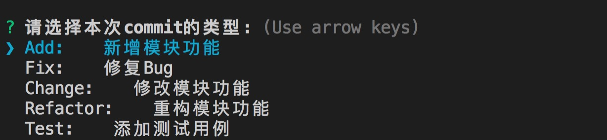

# cz-custom-enhanced

cz-custom-enhanced是在[customizable Commitizen](https://github.com/leonardoanalista/cz-customizable)plugin的基础上进行的二次开发，进一步提高了自定义的粒度
插件的宗旨是将团队的commit信息格式按照[AngularJS team](https://github.com/angular/angular.js/blob/master/CONTRIBUTING.md#-git-commit-guidelines)的风格进行规范化，且提供可视化操作界面。
与此同时，插件的最大亮点是可以自由定义各种不同类型的commit的提交规范，能给予团队在AngularJS team风格的基础上充分制定内部commit规范的空间。

下图是操作界面：



## Steps
* 首选需要安装commitizen插件: `npm install -g commitizen`.
* 然后再安装: `npm install cz-custom-enhanced --save-dev`
* 最后通过配置让 `commitizen` 使用 `cz-custom-enhanced` 作为插件。 你需要在`package.json`中加入如下几行代码:

  ```
  "config": {
    "commitizen": {
      "path": "node_modules/cz-custom-enhanced"
    }
  }
  ```

## Configure
* `cz-custom-enhanced` 默认将会取寻找配置文件 `.cz-config.js`
* 你也可以在 `package.json` 中配置你的配置文件和commitizen的路径:
  ```
  "config": {
    "commitizen": {
      "path": "node_modules/cz-custome-enhanced"
    },
    "cz-customizable": {
      "config": "config/path/to/my/config.js"
    }
  }
  ```
Note:
- 配置 `commitizen` 的路径可以让你无需全局安装 `commitizen`.
- 如果不想自己写配置， 可以直接使用 `cz-config-EXAMPLE.js` 作为你的的配置文件


## Options

`.cz-config.js`:
- entry: 入口参数，规定commit的类型并且可通过设置各种属性对不同类型commit的提交格式进行定制化
``` javascript
entry: {
  Fix: { // commit类型
    value: 'Fix',
    name: 'Fix:    修复Bug', // 标题
    scope: { // 副标题
      custom: true, // 是否
      message: '描述解决了什么问题，如果有Bug号的时候，带上Bug号'
    },
    subject: { // 内容头
      prefix: '原因: ',
      message: '描述引入这个问题的原因'
    },
    body: { // 主内容
      prefix: '方案: ',
      message: '简述解决方案'
    },
    footer: { // 内容位
      prefix: '影响范围: ',
      message: '描述代码影响范围（可选）'
    }
  }
```

- messages: 定义更项信息

``` javascript
messages: {
  type: '请选择本次commit的类型:',
  confirmCommit: '您确认要提交以上的commit吗?'
}
```

- allowCustomScopes: 允许使用自定义范围
